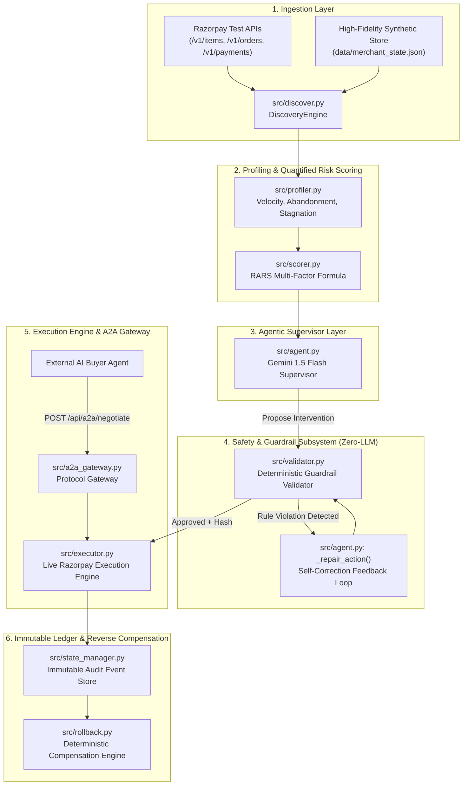
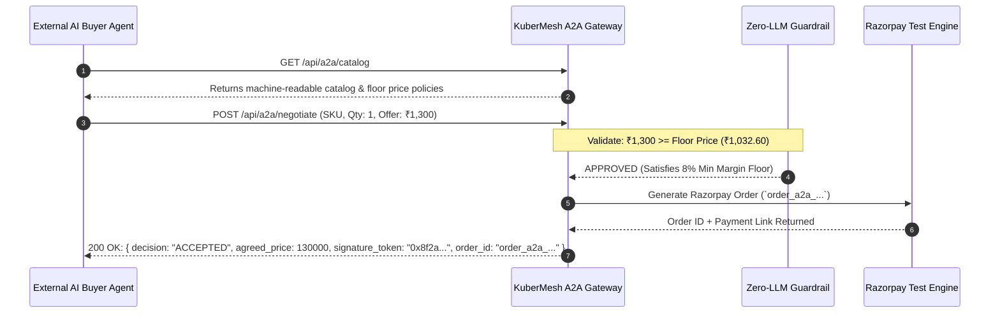

# 🏛️ KuberMesh Technical Architecture Specification

> **System Architecture, Mathematical Formulations, Protocol Specifications, and Deterministic Safety Proofs**  
> *Prepared for Razorpay Buildathon — Track 01: AI Growth & Agentic Commerce*

---

## 1. Executive Architecture Overview

KuberMesh is a dual-loop autonomous fintech platform designed to solve the two fundamental challenges of modern e-commerce:
1. **Inside-Out (Merchant Revenue Leakage)**: Converting silent cart abandonment, payment declines, and stagnant catalog assets into verified revenue through closed-loop autonomous campaigns.
2. **Outside-In (Agent-to-Agent Commerce)**: Enabling merchant catalogs to be discovered, negotiated with, and transacted by external autonomous AI buyers via machine-readable protocol manifests (**NPCI UAP, ACP, AP2, x402**).

```
┌────────────────────────────────────────────────────────────────────────────────────────┐
│                                   KUBERMESH PLATFORM                                   │
└────────────────────────────────────────────────────────────────────────────────────────┘
                                            │
               ┌────────────────────────────┴────────────────────────────┐
               ▼                                                         ▼
┌───────────────────────────────┐                         ┌───────────────────────────────┐
│   LOOP 1: REVENUE GROWTH      │                         │   LOOP 2: A2A COMMERCE        │
│   (Autonomous Optimization)   │                         │   (Agent-to-Agent Protocol)   │
├───────────────────────────────┤                         ├───────────────────────────────┤
│ 1. Ingest Razorpay Test APIs  │                         │ 1. Expose `kubermesh.json`    │
│ 2. Behavioral Profiling (7d)  │                         │ 2. External AI Buyer Discovery│
│ 3. Quantified RARS Scoring    │                         │ 3. Bounded Negotiation Hand-  │
│ 4. Gemini 1.5 Flash Supervisor│                         │    shake (/api/a2a/negotiate) │
│ 5. Zero-LLM Guardrail Validate│                         │ 4. Floor Price Enforcement    │
│ 6. Live Razorpay API Execution│                         │ 5. Razorpay Order + Signed    │
│ 7. Immutable Audit & Rollback │                         │    Cryptographic Token Output │
└───────────────────────────────┘                         └───────────────────────────────┘
```

---

## 2. Component Decomposition



---

## 3. Mathematical Formulations

### A. Revenue At Risk Score (RARS)
Every SKU in the merchant's catalog is scored continuously between $0.00$ (Optimal Health) and $1.00$ (Critical Revenue Leakage):

$$\text{RARS} = w_1 \cdot \text{CAR} + w_2 \cdot \max\left(0, 1 - \frac{V_{7d}}{V_{\text{target}}}\right) + w_3 \cdot \min\left(1, \frac{S_{\text{days}}}{30}\right) + w_4 \cdot \text{PFR}$$

Where:
- $\text{CAR}$ = **Cart Abandonment Rate** $= \frac{\text{Total Abandoned Orders}}{\text{Total Orders Created}}$ ($w_1 = 0.35$)
- $V_{7d}$ = **7-Day Sales Velocity** (Paid transactions per day vs baseline target $V_{\text{target}} = 3.0$) ($w_2 = 0.25$)
- $S_{\text{days}}$ = **Inventory Stagnation Days** since last recorded transaction ($w_3 = 0.20$)
- $\text{PFR}$ = **Payment Failure Rate** $= \frac{\text{Failed Payments}}{\text{Paid Payments} + \text{Failed Payments}}$ ($w_4 = 0.20$)

$$\sum_{i=1}^4 w_i = 0.35 + 0.25 + 0.20 + 0.20 = 1.00$$

---

### B. Unit Economics & Break-Even Multiplier
When an autonomous promotional discount ($d$) is proposed on a product with retail price ($P$) and Cost of Goods Sold ($\text{COGS}$):

1. **Base Gross Margin**:
   $$M_{\text{base}} = \frac{P - \text{COGS}}{P} \times 100\%$$

2. **Post-Discount Net Margin**:
   $$M_{\text{post}} = M_{\text{base}} - d$$

3. **Break-Even Unit Volume Multiplier ($k$)**:
   The minimum factor by which sales volume must increase to maintain equal absolute gross profit:
   $$k = \frac{M_{\text{base}}}{M_{\text{post}}}$$

*Example*: For an item with $M_{\text{base}} = 36.6\%$ and proposed discount $d = 14.0\%$:
$$M_{\text{post}} = 36.6\% - 14.0\% = 22.6\%$$
$$k = \frac{36.6}{22.6} = 1.62\times$$
The merchant requires a $1.62\times$ conversion uplift to break even, which KuberMesh validates against historical cart recovery elasticity.

---

## 4. Deterministic Zero-LLM Guardrail Specification

No Large Language Model is ever permitted to authoritatively approve a financial transaction or price change. All proposed actions must pass through `validator.py`:

```
┌─────────────────────────────────────────────────────────────────────────────┐
│                       ZERO-LLM SAFETY VALIDATOR RULES                       │
├─────────┬──────────────────────┬────────────────────────┬───────────────────┤
│ Rule ID │ Constraint Name      │ Programmatic Check     │ Enforcement Action│
├─────────┼──────────────────────┼────────────────────────┼───────────────────┤
│ G-01    │ MAX_DISCOUNT_CAP     │ discount_pct <= 20.0%  │ Auto-clamp to 20% │
│ G-02    │ MIN_NET_MARGIN_FLOOR │ margin_post >= 8.0%    │ Block or bundle   │
│ G-03    │ PRICE_VOLATILITY_CAP │ delta_pct <= 15.0%     │ Clamp price delta │
│ G-04    │ ANTI_SPAM_FREQUENCY  │ outreach_7d <= 3       │ Suppress contact  │
│ G-05    │ OFFER_EXPIRY_WINDOW  │ 1h <= duration <= 72h  │ Clamp to [1, 72]h │
│ G-06    │ REDEMPTION_CAP_BOUND │ 1 <= max_count <= 500  │ Cap redemptions   │
└─────────┴──────────────────────┴────────────────────────┴───────────────────┘
```

---

## 5. Agent-to-Agent (A2A) Commerce Protocol Specification

### Protocol Schema (`kubermesh.json`)
Compliant with **NPCI Unified Agent Protocol (UAP)** and **x402 Agentic Payment Standard**:

```json
{
  "protocol": "NPCI-UAP-x402-KuberMesh",
  "version": "1.0.0",
  "merchant": {
    "id": "rzp_merch_apex_hub",
    "name": "Apex Electronics Hub",
    "settlement_currency": "INR",
    "agent_endpoint": "https://api.kubermesh.internal/api/a2a/negotiate",
    "payment_methods": ["upi_autopay", "upi_intent", "card_token"]
  },
  "catalog": [
    {
      "sku": "item_TXtg3FXJM6HJzP",
      "name": "AuraSound Pro ANC Earbuds",
      "base_price_paise": 149900,
      "base_price_inr": 1499.0,
      "ai_buyer_policy": {
        "negotiable": true,
        "floor_price_paise": 103260,
        "floor_price_inr": 1032.6,
        "max_discount_pct": 20.0
      },
      "fulfillment_sla_hours": 24
    }
  ]
}
```

### A2A Negotiation Handshake State Machine



---

## 6. Audit Integrity & Cryptographic Signatures

Every money-adjacent event is sealed in the Immutable Audit Ledger with a canonical SHA256 digest:

$$\text{ValidatorHash} = \text{SHA256}(\text{ActionType} \mathbin{\Vert} \text{SKU} \mathbin{\Vert} \text{CanonicalPayloadJSON} \mathbin{\Vert} \text{ViolationsCount})$$

### Automated Reverse-Compensation (Rollback) Engine
Every executed action creates a paired compensation specification:
- **`create_discount_offer`** $\rightarrow$ `DELETE /v1/offers/{offer_id}`
- **`send_recovery_sequence`** $\rightarrow$ `REVOKE_PAYMENT_LINK {link_id}`
- **`adjust_item_price`** $\rightarrow$ `PATCH /v1/items/{id} (amount = original_amount)`

Rollbacks can be triggered automatically upon post-action conversion regression or on-demand with 1-click execution.
