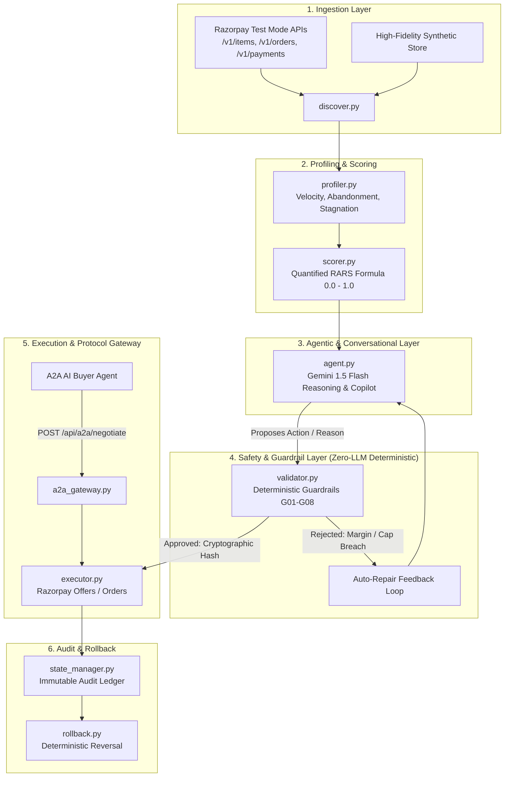

# ⚡ KuberMesh
> **Autonomous Revenue Optimizer & Agent-to-Agent (A2A) Commerce Protocol for Razorpay Merchants**  
> *Built for Razorpay Buildathon — Track 01: AI Growth & Agentic Commerce*

[](https://steam-situated-campaigns-knife.trycloudflare.com)
[](https://www.python.org/)
[](https://fastapi.tiangolo.com/)
[](https://opensource.org/licenses/MIT)
[](https://razorpay.com/)

👉 **Live Public HTTPS Demo**: **[https://steam-situated-campaigns-knife.trycloudflare.com](https://steam-situated-campaigns-knife.trycloudflare.com)**  
[](https://render.com/deploy?repo=https://github.com/rakeshraks2612-maker/KuberMesh)

---

## 📌 Executive Summary

Indian merchants lose **28–35% of potential GMV** to silent cart drop-offs, payment failure bounces, dead inventory, and mispriced catalog items. Simultaneously, as AI buyer agents begin transacting autonomously across emerging protocols (**NPCI UAP, ACP, AP2, x402**), merchant catalogs remain trapped in unstructured HTML and static portals without machine-readable negotiation gateways.

**KuberMesh** is a dual-engine autonomous platform:
1. **Inside-Out (Merchant Growth)**: Discovers Razorpay catalog data, profiles sales velocity and cart abandonment, calculates the quantified **Revenue At Risk Score (RARS)**, reasons over interventions via Gemini 1.5 Flash, strictly gates every rupee action through a **deterministic zero-LLM safety validator**, executes via Razorpay APIs, and logs to an immutable audit ledger with automated rollback.
2. **Outside-In (A2A Commerce Protocol)**: Automatically compiles and serves an agent-readable manifest (`kubermesh.json`), exposing a bounded endpoint (`/api/a2a/negotiate`) where external AI buyers can discover inventory, negotiate discounts within margin bounds, and receive instant Razorpay checkout orders.

---

## 🏛️ System Architecture



---

## 📐 Mathematical Specification: Revenue At Risk Score (RARS)

Every SKU in the catalog is profiled continuously:

$$\text{RARS} = 0.35 \cdot \text{CAR} + 0.25 \cdot \max\left(0, 1 - \frac{V_{7d}}{V_{\text{target}}}\right) + 0.20 \cdot \min\left(1, \frac{S_{\text{days}}}{30}\right) + 0.20 \cdot \text{PFR}$$

Where:
* **$\text{CAR}$**: Cart Abandonment Rate ($\frac{\text{Abandoned Orders}}{\text{Total Orders Created}}$)
* **$V_{7d}$**: 7-day Sales Velocity (Paid orders/day vs Target baseline $V_{\text{target}} = 3.0$)
* **$S_{\text{days}}$**: Inventory Stagnation Days since last recorded sale
* **$\text{PFR}$**: Payment Failure Rate ($\frac{\text{Failed Payments}}{\text{Total Payment Attempts}}$)

---

## 🛡️ Zero-LLM Deterministic Guardrail Matrix

| Rule ID | Name | Constraint | Failure Behavior |
| :--- | :--- | :--- | :--- |
| **G-01** | `MAX_DISCOUNT_CAP` | $\text{Discount} \le 20.0\%$ | Rejection triggers agent discount auto-clamp. |
| **G-02** | `MIN_NET_MARGIN` | $\text{Base Margin} - \text{Discount} \ge 8.0\%$ | Prevents predatory pricing or negative unit economics. |
| **G-03** | `PRICE_VOLATILITY` | $|\Delta \text{Price}| \le 15.0\%$ | Prevents accidental flash drops. |
| **G-04** | `RECOVERY_SLA` | $\le 3\text{ contacts / cust / week}$ | Enforces anti-spam consumer protection. |
| **G-05** | `OFFER_EXPIRY` | $1\text{h} \le \text{Duration} \le 72\text{h}$ | Restricts permanent indefinite margin leakage. |

---

## 🤖 A2A Protocol Manifest (`kubermesh.json`)

External AI buyer agents query `GET /api/a2a/catalog` to ingest machine-readable policies:

```json
{
  "protocol": "NPCI-UAP-x402-KuberMesh",
  "version": "1.0.0",
  "merchant": {
    "id": "rzp_merch_apex_hub",
    "name": "Apex Electronics Hub (Razorpay Verified)",
    "agent_endpoint": "http://localhost:8000/api/a2a/negotiate"
  },
  "catalog": [
    {
      "sku": "item_earbuds_pro",
      "name": "AuraSound Pro ANC Earbuds",
      "base_price_paise": 149900,
      "base_price_inr": 1499.0,
      "inventory_available": 85,
      "ai_buyer_policy": {
        "negotiable": true,
        "floor_price_paise": 103260,
        "floor_price_inr": 1032.6,
        "max_discount_pct": 20.0
      },
      "fulfillment_sla_hours": 24
    }
  ]
}
```

---

## 🚀 Quickstart & Execution Guide

### 1. Installation
```bash
git clone https://github.com/rakeshraks2612-maker/KuberMesh.git
cd KuberMesh
python3 -m venv .venv && source .venv/bin/activate
pip install -r requirements.txt
```

### 2. Environment Setup (Optional for Live Razorpay Test Mode)
```bash
export RAZORPAY_KEY_ID="rzp_test_YOUR_KEY"
export RAZORPAY_KEY_SECRET="YOUR_SECRET"
export GEMINI_API_KEY="YOUR_GEMINI_KEY"
```
*(If credentials are omitted, KuberMesh operates seamlessly via its high-fidelity synthetic container)*.

### 3. Run Automated Test Suite
```bash
pytest -v tests/test_suite.py
```

### 4. Launch Command Center
```bash
uvicorn src.server:app --port 8000 --reload
```
Open **[http://localhost:8000](http://localhost:8000)** in your browser.

---

## 🎬 Graceful Failure & Rollback Demo Arc (For Judges)

1. Click **"Demo Graceful Failure & Auto-Repair"**:
   - The agent proposes an aggressive **25% Flash Discount** on *AuraSound Pro Earbuds*.
   - The **Zero-LLM Safety Validator** rejects the proposal (`G-01 Violated: Discount 25% > Max 20%`).
   - The **Self-Correction Engine** re-reasons, auto-clamps the discount to **14.0%**, restoring margin to **22.6%**.
   - The validator verifies and issues cryptographic hash `0x7f2a...`.
   - Razorpay Offer is created (`offer_rzp_...`).
2. Navigate to **"Immutable Audit Ledger"**:
   - Observe the full decision trail with before/after RARS score.
   - Click **"Rollback"** to test 1-click reverse compensation (`DELETE /v1/offers/{id}`).
3. Navigate to **"A2A Gateway"**:
   - Test an external AI Buyer offer of `₹1,300` -> Handshake responds `ACCEPTED` with signed token and Razorpay checkout order link.
